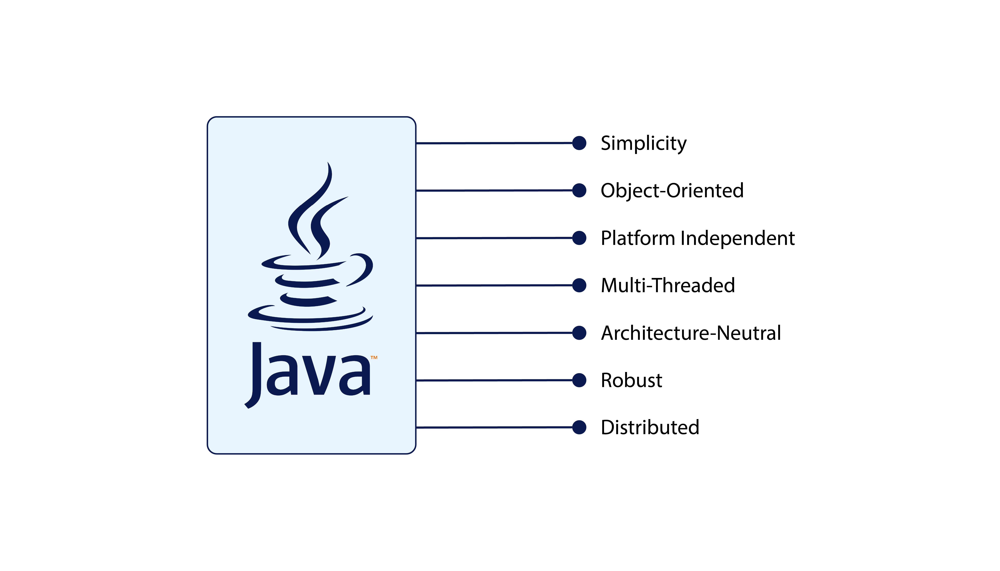
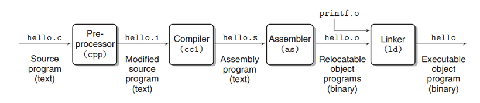
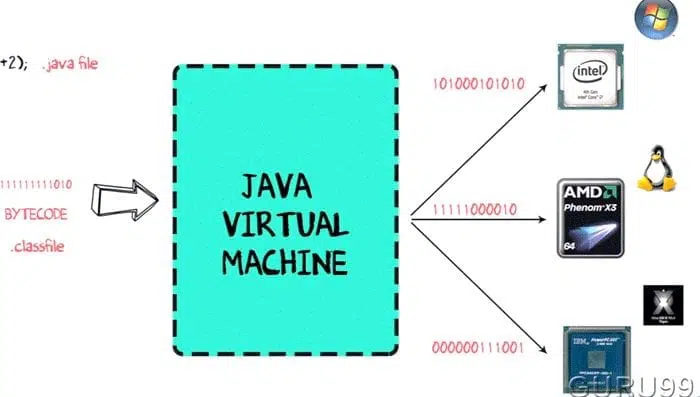
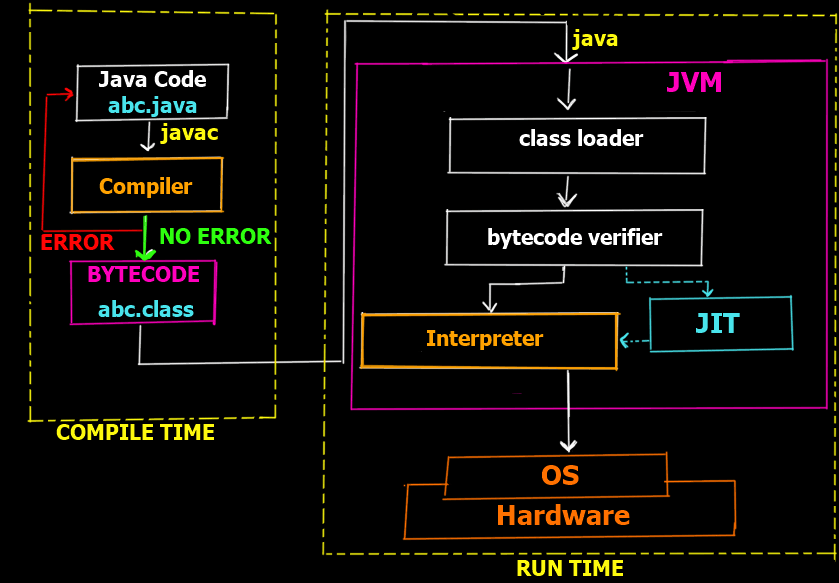
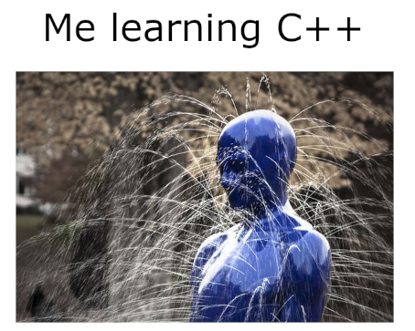
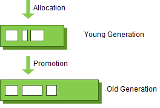
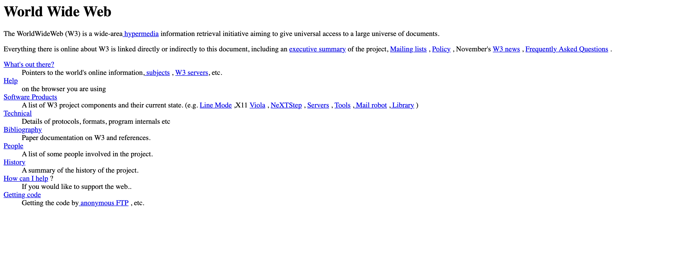

# 개요

많은 기업들이 자바 기반으로 프로그램을 개발합니다. 자바는 1995년 썬 마이크로시스템즈의 제임스 고슬링이 다른 연구원들과 함꼐 개발한 객체 지향적 언어입니다. 발표된지 28년이 넘어가지만 자바는 아직도 우리나라에서 혹은 전세계적으로 가장 많이 쓰이는 언어 중 하나입니다. 특히 특정 도메인, 혹은 일부 영역에서만 쓰이지 않고, 웹 어플리케이션, 모바일 환경 등의 현재 쓰이는 언어 중에 가장 다양한 분야에서 쓰이는 언어일 것입니다.

이번 포스트에서는 자바는 어떻게 이렇게 오랫동안 인기를 누릴 수 있었는지 알아보겠습니다.

위 이미지는 자바의 주요 특징등을 정리한 이미지입니다. 모든 부분이 중요한 내용이지만 그 중에서 가장 핵심적인 내용을 위주로 정리해보겠습니다.

## 플랫폼과 독립적

자바가 처음 발표하면서 걸었던 슬로건은 "한 번 프로그래밍한 것은 어떤 플랫폼에서도 실행된다"는 것이었습니다. 어떤 플랫폼에서 실행된다는 뜻은 실행되는 컴퓨터의 운영체제, 아키텍쳐에 영향을 받지 않고 실행된다는 뜻입니다. 이러한 특징이 왜 슬로건을 걸 정도로 중요한 내용이었을까요? 이걸 이해하기 위해서는 자바가 등장하기 전의 언어들의 컴파일 과정을 이해할 필요가 있습니다. 간단하게 C언어의 컴파일 과정을 살펴보죠.

### C언어의 컴파일 과정

> 리눅스 gcc에서 컴파일 과정
>
> 1. 전처리를 거쳐서 매크로를 처리한다.
>
> - #include, #define 이 대표적인 매크로이다.
>
> 2. 컴파일러를 통해서 어셈블리 언어로 변환한다.
> 3. 어셈블러를 통해서 목적파일로 변환한다.
>    - 리눅스나 맥에서 커맨드라인에서 컴파일 해본사람은 알겠지만 여기서 gcc 결과물로 나오는.o 파일이 여기서 얘기하는 목적파일이다.
> 4. 링커를 통해서 여러개의 목적파일을 하나의 실행파일로 변환한다.
>
> 윈도우 환경이라면 여기서 최종 파일로 .exe 확장자가 붙은 파일이 있을 것이다.
> 출처 : [C언어가 cpu에 작동하기까지](https://eeeuns.github.io/2021/10/27/understandingcomputer/)

위 과정에서 특이한 점이 있다면 환경마다 목적파일이 다르다는 것을 확인할 수 있습니다. 이것이 플랫폼마다 컴파일러가 다르다는 의미입니다.

출처 : https://thirdeyedata.ai/java/

하지만 자바는 위 이미지처럼 어떠한 플랫폼에도 상관없이 같은 클래스 파일을 컴파일링하도록 해줍니다. 이러한 별도의 작업 없이 서로 다른 기종을 넘나들며 동일하게 동작하는 프로그램은 자바의 가장 중요한 특성 중 하나입니다. 이처럼
서로 다른 플랫폼에서 동일한 프로그램을 실행할 수 있는 능력은 웹기반 소프트웨어에 필수적이며, 자바는 플랫폼과 언어에 독립적이기 때문에 개발자들에게 매우 많은 사랑을 받기 시작했습니다.

출처 : https://simplesnippets.tech/execution-process-of-java-program-in-detail-working-of-just-it-time-compiler-jit-in-detail/

## 높은 메모리 안정성

자바가 발표되기 이전 대표적인 언어들인 C/C++ 에서는 개발자가 프로그램의 메모리를 직접 관리해줘야 했습니다. 예를 들어 C++ 동적으로 메모리를 할당했을 때, 할당된 메모리를 모두 해제하지 않을 때 아름다운 메모리 누수를 체험할 수 있습니다.

하지만 자바의 개발자는 이러한 걱정을 크게 할 필요가 없습니다. 바로 JVM이 메모리 관리를 대신 해주기 때문이죠. 아러한 메모리 관리를 하기 위해 JVM은 가비지 컬렉터(Garbage Collection : GC)를 사용합니다.

JVM의 Heap영역은 처음 설계될 때 다음의 2가지를 전제(Weak Generational Hypothesis)로 설계되었습니다.

- 대부분의 객체는 금방 접근 불가능한 상태(Unreachable)가 된다.
- 오래된 객체에서 새로운 객체로의 참조는 아주 적게 존재한다.

객체는 대부분 일회성되며, 메모리에 오랫동안 남아있는 경우는 드물다는 것입니다. 그렇기 때문에 객체의 생존 기간에 따라 물리적인 Heap 영역을 나누게 되었고 Young, Old 총 2가지 영역으로 설계되었죠. (초기에는 Perm 영역이 존재하였지만 Java8부터 제거되었습니다.)

### 가비지 컬렉션 구조

자바의 가비지 컬렉션의 주요 구조는 아래와 같습니다.

- Young 영역(Young Generation)
  - 새롭게 생성된 객체가 할당(Allocation)되는 영역
  - 대부분의 객체가 금방 Unreachable 상태가 되기 때문에, 많은 객체가 Young 영역에 생성되었다가 사라진다.
  - Young 영역에 대한 가비지 컬렉션(Garbage Collection)을 Minor GC라고 부른다.
- Old 영역(Old Generation)
  - Young영역에서 Reachable 상태를 유지하여 살아남은 객체가 복사되는 영역
  - Young 영역보다 크게 할당되며, 영역의 크기가 큰 만큼 가비지는 적게 발생한다.
  - Old 영역에 대한 가비지 컬렉션(Garbage Collection)을 Major GC라고 부른다.

출처 : [Garbage Collection(가비지 컬렉션)의 개념 및 동작 원리 (1/2)](https://mangkyu.tistory.com/118)

이번 글에서는 자바의 가비지 컬렉션의 자세한 내용이 주제가 아니기 때문에, 더 자세한 내용은 나중에 이야기할 기회가 될 때 이야기하겠습니다. 이번 글에서 가장 중요한 내용은 자바의 경우 메모리 관리를 개발자가 직접 하는 것이 아닌 자바에서 관리해주며 개발자는 오로지 개발에만 집중할 수 있는 환경을 만들어 주었고, 이는 곧 개발 속도를 아주 많이 향상시켜줬습니다. 소프트웨어 개발 속도는 곧 돈입니다. 즉 자바로 개발을 진행한다면 C/C++로 개발을 하는 것 보다도 금전적인 이득이 있었다는 것입니다.

## 객체 지향 프로그래밍

자바는 객체 지향 프로그래밍 언어입니다. 객체 지향 프로그래밍은 프로그램을 단순히 데이터와 처리 방법으로 나누는 것이 아니라, 프로그램을 수많은 '객체(object)'라는 기본 단위로 나누고 이들의 상호작용으로 서술하는 방식입니다. 객체란 하나의 역할을 수행하는 '메소드와 변수(데이터)'의 묶음으로 보죠.

객체 지향 프로그래밍의 등장 배경을 알기 위해서는 객체 지향 프로그래밍이 나오기 이전의 프로그래밍 방식을 간단하게 살펴봐야 합니다. 초기 프로그래밍 방식은 절차적 프로그래밍 방식이었습니다. 프로그램을 명령어의 모음으로 인식한 것이었죠. 또한 프로그래밍이란 어떻게 어떤 논리를 어떤 순서대로 써나가는 것인가로 간주되었습니다. 즉, 프로그램 자체가 가지는 기능에 대해서만 신경을 썼지, 이 프로그램이 대체 어떤 데이터를 취급하는 것인가에는 그다지 관심이 없었던 것입니다. 그러나, 이 방식은 간단한 알고리즘이면 모를까 조금만 복잡해지면 순서도로 나타내는 것이 불가능할 정도로 꼬인 "스파게티 코드"를 만들게 됩니다.

이를 극복하기 위한 대안으로 등장한 것이 바로 객체 지향 프로그래밍입니다. 큰 문제를 작게 쪼개는 것이 아니라, 먼저 작은 문제들을 해결할 수 있는 객체들을 만든 뒤, 이 객체들을 조합해서 큰 문제를 해결하는 상향식(Bottom-up) 해결법을 도입한 것이죠. 이 객체란 것을 일단 한번 독립성/신뢰성이 높게 만들어 놓기만 하면 그 이후엔 그 객체를 수정 없이 재사용할 수 있으므로 개발 기간과 비용이 대폭 줄어들게 됩니다.

하지만 객체 지향 프로그래밍은 등장 당시에는 기존의 절차적 프로그래밍과 비교해 매우 이질적이고, 당시 컴퓨터의 처리능력이 별로 좋지 않아서 별 주목을 받지 못하였습니다. 그러다가 GUI가 등장하면서 객체 지향 프로그래밍이 급부상하게 되었습니다. 화면에 떠 있는 여러 개의 창은 각자의 실행 콘텍스트를 가지는데 콘텍스트의 현재 상태(활성화, 비활성화, 최소화 등)에 따라 같은 명령에도 다른 결과를 내보내야 했으며 사용자 상호작용을 위해 이벤트 처리도 수행해야 했습니다.

이러한 상황에서 웹이 등장했습니다.

웹이 등장한 이유 인터넷 기반의 IT 서비스는 우후죽순 생겨났습니다. 그리고 이러한 IT 서비스의 기능을 최대한 유저 친화적으로 제공하기 위해 GUI에 대해 많은 고민이 있었고 점차 객체 지향 프로그래밍 언어의 관심도가 매우 높아졌습니다.

물론 객체 지향 프로그래밍 언어로 자바만 있는 것은 아닙니다. C++도 객체 지향 프로그래밍 언어입니다. 하지만 자바의 경우 오픈소스였으며 어떠한 플랫폼애도 의존하지 않고 코드를 실행할 수 있다는 장점과 개발자가 직접 메모리 관리를 할 필요가 없는 등의 개발 생산성 측면에서 아주 많은 IT 기업들이 사용하는 언어가 된 것입니다.

### 참고 자료

[많은 기업들이 자바를 사용하는 이유](https://coding-factory.tistory.com/839)
[끈질긴 생명력... '자바'가 여전히 위대한 이유 7가지](https://www.ciokorea.com/news/246166#csidxd3d5924fe5d611cb60ac0454ac7e0f7)
